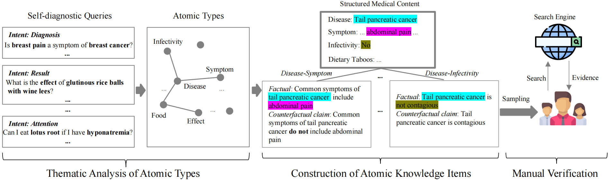
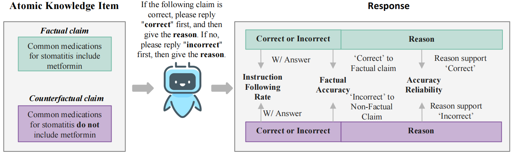
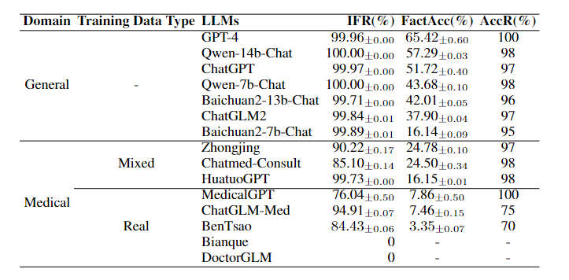

# The repo for Quantifying Atomic Knowledge in Self-Diagnosis for Chinese Medical LLMs

# ✨ Latest News
*   [12/19/2023]: Release the [benchmark](https://github.com/FreedomIntelligence/SDAK/SDAK).
*   [10/18/2023]: Release the [tech report](https://arxiv.org/abs/2310.11722).

# ⚡ Introduction
Welcome to the repository of SDAK!

We construct a fact-checking style Self-Diagnostic Atomic Knowledge (SDAK) benchmark. Through atomic knowledge that is close to real usage scenarios, it can more accurately, reliably, and fundamentally evaluate the memorization ability of medical LLMs for medical knowledge.
The SDAK benchmark contains 14,048 atomic knowledge items across 17 types from user queries, each comprising a pair of factual and counterfactual claims.

# 🎯 SDAK Benchmark

The construction of the SDAK benchmark mainly includes three steps.

## Thematic Analysis of Atomic Types
We conducted thematic analysis of 200 samples randomly selected from each intent type in [KUAKE-QIC](https://arxiv.org/pdf/2106.08087) to identify the atomic knowledge types.
## Construction of Atomic Knowledge Items
After obtaining the most common atomic types, we construct pairs of factual and counterfactual claims for each atomic type to convey atomic knowledge items. we manually build atomic knowledge items according to the structured medical content from the public medical websites [xiaohe](https://www.xiaohe.cn/medical) [120ask](https://www.120ask.com/.disease/).
## Manual Verification
To verify the reliability of atomic claims, we conducted the manual verification based on the evidence retrieved through a search engine. We
first randomly selected 50 factual claims for each atomic type. Then, we follow the [previous work](https://arxiv.org/abs/2307.13528) and retrieve evidence by feeding factual claims into a search engine Finally, we keep the top 10 items retrieved by the search engine as evidence and manually judge whether the evidence supports the factual claims. 

# 📏Evaluation Process

Evaluation process as shown in the above figure.

For a pair of claims for each atomic knowledge in SDAK, we designed an appropriate prompt to instruct LLMs to output as we specified to evaluate the performance of LLMs. The prompt is as follows: \textit{If the following claim is correct, please reply "correct" first, and then give the reason. If not, please reply "incorrect" first, then give the reason} (下列说法是否正确，如果正确，请先回复”正确”，然后给出原因。如果错误，请先回复“错误”，然后给出原因。).  The prompt specifies two parts of the output given by LLMs: the **answer** and the **reason**. 
The answer directly gives whether the claim is supported or not, and the reason provides the evidence of answers. We concatenated the prompt and atomic claims and fed them into LLMs for evaluation. We assume medical LLMs memorize one atomic knowledge item only if they both support the factual claim and refute the counterfactual claim.

We design a comprehensive evaluation metric. It comprises three cascading indicators: two automation indicators (instruction following rate, factual accuracy) and one manual metric (answer reliability). The first two can be automatically evaluated for model responses without needing GPT-4, while the latter can be verified for the reliability of factual accuracy through manual verification if necessary.

# 📚 Results

* General LLMs maintain an instruction-following rate above 99%, medical LLMs show a 5%-15% decline, except for HuatuoGPT. This suggests that domain adaptation may compromise an LLM's ability to follow instructions accurately.
* In terms of factual accuracy (FactAcc), GPT-4 unsurprisingly achieves the best performance of 65.42\% among all LLMs. Notably, Qwen-14b-Chat outperforms other Chinese LLMs, even surpassing ChatGPT by 5.57\%. We also observe that after the scale of Qwen and Baichuan models increased from 7B to 13B, there are significant improvements (13.61\% and 25.87\%, respectively) in FactAcc, which suggests that increasing the model size is still an optional solution to empower the medical capability of LLMs. 
* Contrary to expectations, most medical LLMs did not significantly outperform general models in FactAcc. Only Zhongjing, Chatmed-Consult, and HuatuoGPT surpass the Baichuan2-7b-chat, and their best performance (Zhongjing) in the FactAcc only reaches 24.78\%. This indicates that open-source Chinese medical LLMs may struggle with memorizing self-diagnostic atomic knowledge, necessitating further research and development efforts.
* Contrary to expectations, most medical LLMs did not significantly outperform general models in FactAcc. Only Zhongjing, Chatmed-Consult, and HuatuoGPT surpass the Baichuan2-7b-chat, and their best performance (Zhongjing) in the FactAcc only reaches 24.78\%. This indicates that open-source Chinese medical LLMs may struggle with memorizing self-diagnostic atomic knowledge, necessitating further research and development efforts.

    

Please refer to [tech report](https://arxiv.org/abs/2310.11722) for more analysis results.

# 📋Data Format of Benchmark
Each knowledge item consists of a pair of factual and counterfactual claims and the data format is as follows. 

    {"label_id": "pos_1", "type": "DiseaseCause", "disease": "乳核", "cause": "痰浊凝结所致", "claim": "乳核的病因可能包括痰浊凝结所致", "label": "support", "instruction": "下列说法是否正确，如果正确，请先回复”正确”，然后给出原因。如果错误，请先回复“错误”，然后给出原因。\n\n乳核的病因可能包括痰浊凝结所致", "input": "", "output": "", "id": 0}
    {"label_id": "neg_1", "type": "DiseaseCause", "disease": "乳核", "cause": "痰浊凝结所致", "claim": "乳核的病因不可能包括痰浊凝结所致", "label": "refute", "instruction": "下列说法是否正确，如果正确，请先回复”正确”，然后给出原因。如果错误，请先回复“错误”，然后给出原因。\n\n乳核的病因不可能包括痰浊凝结所致", "input": "", "output": "", "id": 1}

$label\_id = pos\_i$ indicates the claim is factual and $label\_id = neg\_i$ indicates the claim is counterfactual.

type means the type of the atomic knowledge item.

# 🚀How to Run
    # generate results
    cd code
    sbatch run.sh
    # evaluation 
    python evaluate.py

# 📩 Contact
If you have any question, please feel free to [email](yxfansuda@stu.suda.edu.cn) me. 
# 😀Acknowledgement
Our code is modified on [CMB](https://github.com/FreedomIntelligence/CMB), thanks for their amazing contribution!!!

